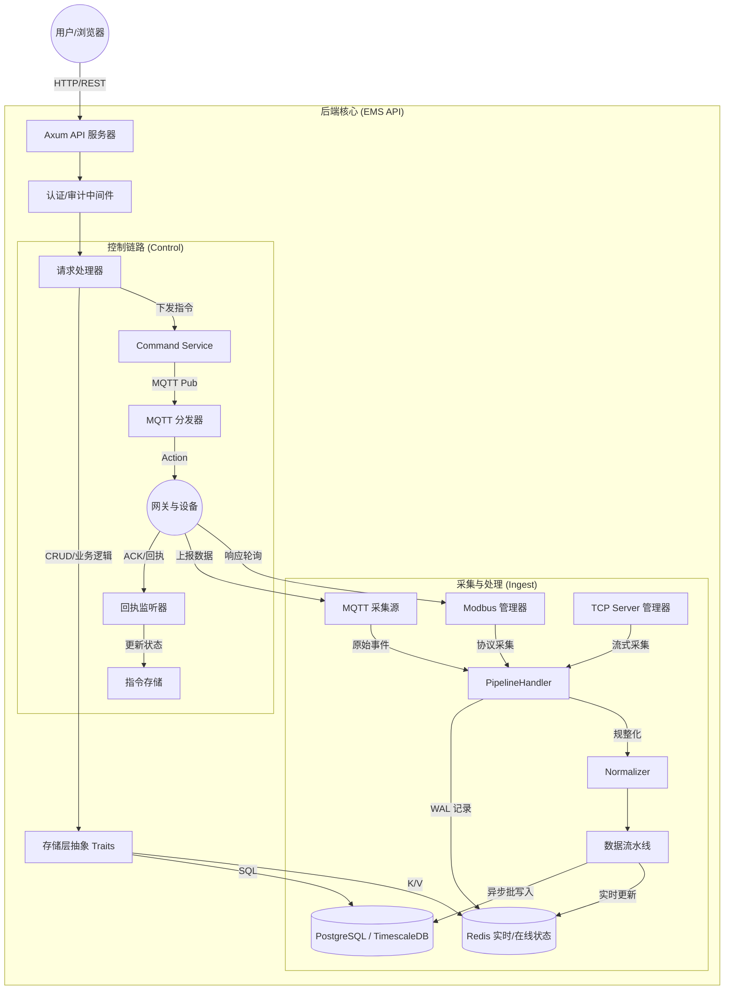

# EMS 系统架构深度解析与辩证理解

本文档旨在记录对 EMS（能源管理系统）系统架构的深度阅读笔记、辩证理解以及核心运行流程图。

---

## 一、 架构的辩证理解：对立与统一

通过对 `ARCHITECTURE.md` 及核心源码（`main.rs`, `ingest.rs` 等）的分析，系统体现了以下核心设计哲学：

### 1. 静态配置与动态运行的统一
*   **对立**：系统配置（如网关协议、点位映射）相对静态，存储于 PostgreSQL；而数据采集是高频、动态的流式过程。
*   **统一**：通过 `ModbusProtocolManager` 和 `TcpServerProtocolManager` 等任务管理器，实现了从“静态配置”到“动态异步任务”的平滑转换，支持配置变更时的任务热重启。

### 2. 同步 API 与异步流水线的解耦
*   **对立**：HTTP API 追求低延迟响应（同步操作）；数据入库（尤其是进入时序库）通常伴随高吞吐开销。
*   **统一**：系统引入了 `Pipeline` 缓冲层和 `RedisRealtimeStore`。API 读实时值走 Redis（极速），写时序数据走 Pipeline 定时刷盘（吞吐优化），确保了用户体验与系统性能之间的平衡。

### 3. 通用架构与特殊协议的兼容
*   **对立**：系统追求一套通用的 `Normalizer`（规整算法）处理逻辑。
*   **统一**：在保持处理逻辑通用的同时，在 `handlers` 校验层和 `protocol` 细节层完美保留了对 Modbus, MQTT, Native TCP 的差异化支持，实现了“中间厚（通用逻辑）、两头尖（细节处理）”的漏斗型设计。

---

## 二、 系统运行流程图

---

## 三、 核心程序流程说明

### 1. 引导阶段 (Bootstrap)
*   **初始化**：读取配置、启动 Tracing 日志。
*   **服务注册**：将各数据库连接池包装进 `AppState` 注入 Axum。
*   **任务激活**：在后台线程启动采集源和回执监听任务。

### 2. 采集流 (Ingest Flow)
*   **输入**：从 MQTT, Modbus 或 TCP 读取原始字节流。
*   **保障**：先入 WAL (Redis)，防止处理崩溃丢数。
*   **转化**：`Normalizer` 查表将外部地址转换为系统 `point_id`。
*   **分流**：
    *   **热路径**：立即更新 Redis 实时值和设备在线状态。
    *   **冷路径**：进入 Pipeline 缓冲区，每秒批量落盘到 TimescaleDB。

### 3. 控制与业务流 (Control & Business Flow)
*   **查询**：API 根据请求类型分发到对应 Store。实时数据读 Redis，历史趋势查 PG。
*   **指令**：用户发出指令 -> `CommandService` 记录并分发 -> MQTT 传输 -> 现场动作 -> 回执异步更新数据库。

---

## 四、 商业级特性
*   **优雅停机**：监听 SIGTERM/SIGINT，确保 Pipeline 缓冲区在关闭前强制刷盘。
*   **多租户/隔离**：利用 `TenantContext` 在所有的 Store 层实现租户和项目范围的物理隔离校验。
*   **时序优化**：要求 TimescaleDB 扩展，优化历史测量数据的高频写入与统计查询。
