# EMS 项目运行逻辑流程图

## 目录
1. [系统整体架构](#系统整体架构)
2. [用户登录与认证流程](#用户登录与认证流程)
3. [API 请求处理流程](#api-请求处理流程)
4. [数据 CRUD 操作流程](#数据-crud-操作流程)
5. [多租户上下文传播流程](#多租户上下文传播流程)
6. [JWT Token 刷新流程](#jwt-token-刷新流程)
7. [动态路由加载流程](#动态路由加载流程)

---

## 系统整体架构

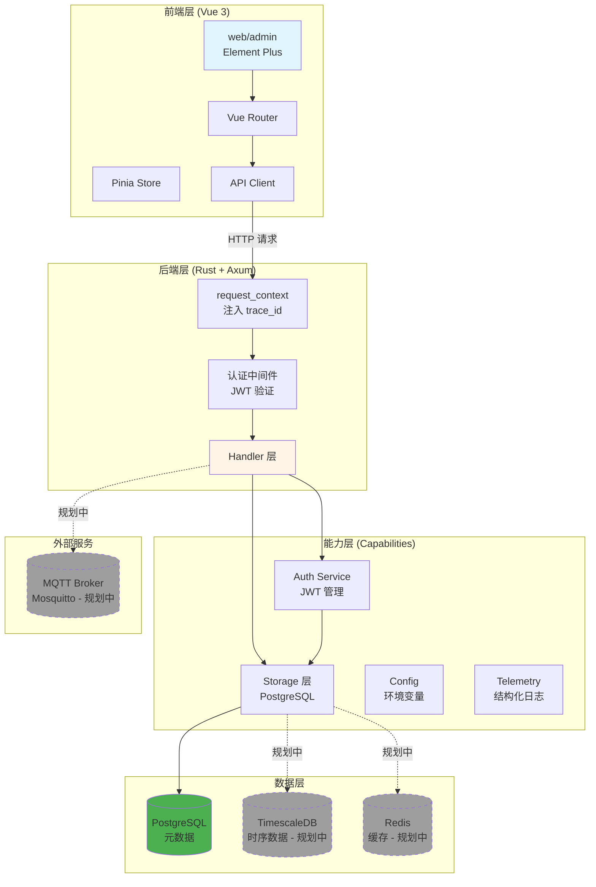

---

## 用户登录与认证流程

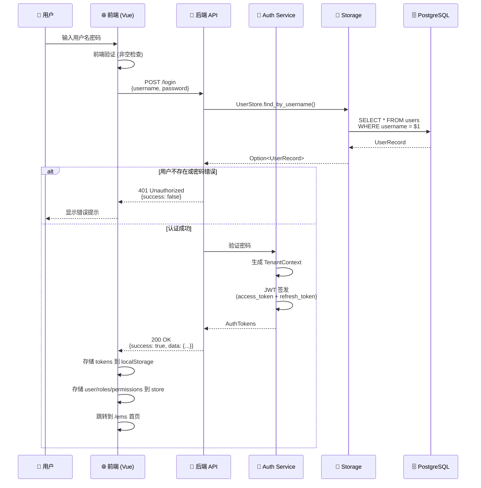

**关键点：**
- 密码当前为明文存储（待修复）
- JWT 包含 `tenant_id`、`user_id`、`roles`、`permissions`
- `expires` 为 Unix 毫秒时间戳

---

## API 请求处理流程

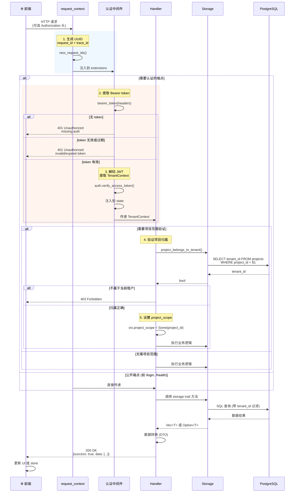

**核心原则：**
1. **所有请求**都生成 `request_id` 和 `trace_id`
2. **认证端点**需要有效的 Bearer token
3. **项目级操作**验证项目归属当前租户
4. **所有 SQL**查询都带 `tenant_id` 过滤

---

## 数据 CRUD 操作流程

以"创建项目"为例：

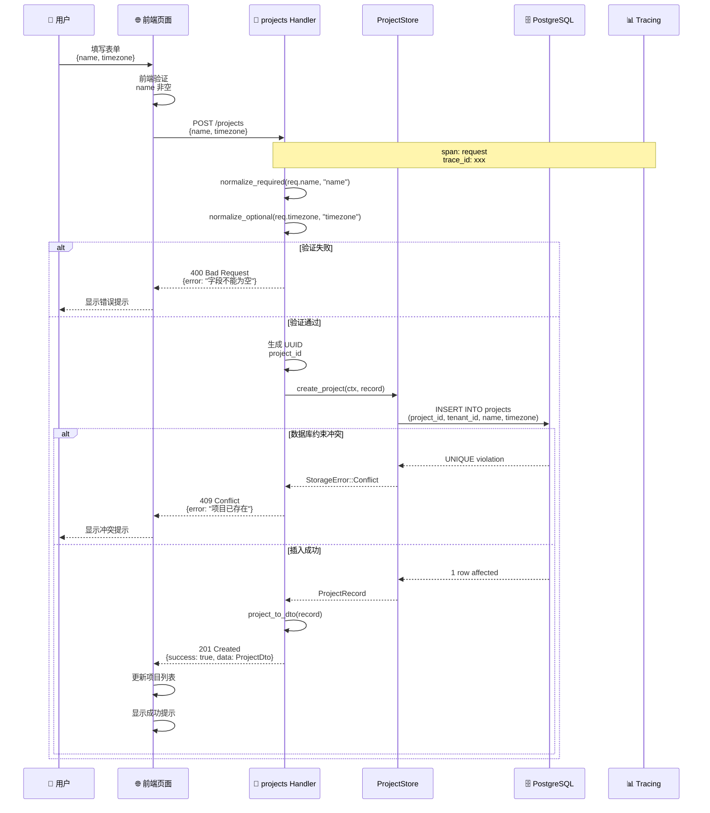

**验证流程：**
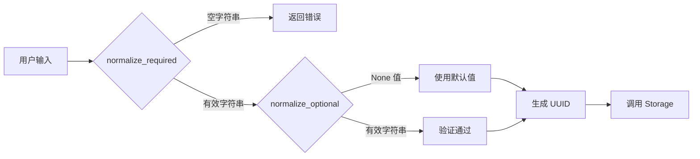

---

## 多租户上下文传播流程

```mermaid
graph TB
    subgraph "JWT Token 内容"
        JWT[JWT Payload]
        TID["tenant_id: "tenant-1""]
        UID["user_id: "user-1""]
        ROLE["roles: ["admin"]""]
        PERM["permissions: ["PROJECT.READ", ...]""]
        JWT --> TID
        JWT --> UID
        JWT --> ROLE
        JWT --> PERM
    end

    subgraph "后端处理链"
        AUTH[auth.verify_access_token]
        CTX[TenantContext<br/>包含上述 4 个字段]
        MW[认证中间件]
        HS[Handler]
        ST[Storage Trait]
        PGSQL[PostgreSQL]
    end

    JWT --> AUTH
    AUTH --> CTX
    CTX --> MW
    MW -->|注入到请求状态| HS

    subgraph "项目级操作"
        HS -->|require_project_scope| VALID{验证项目归属}
        VALID -->|true| SCOPE["ctx.project_scope = Some(project_id)""]
        VALID -->|false| ERR[403 Forbidden]
    end

    SCOPE --> ST
    HS -->|无需项目范围| ST
    ST -->|显式传递 &ctx| PGSQL
    PGSQL -->|WHERE tenant_id = $1<br/>AND project_id = $2| RESULT[租户隔离的结果]

    style JWT fill:#fff3cd
    style CTX fill:#d1c4e9
    style RESULT fill:#4caf50
    style ERR fill:#f44336
```

**关键不变量：**
1. `tenant_id` 从 JWT 提取，不在 URL 中
2. 所有数据库查询自动带 `WHERE tenant_id = ?`
3. `project_scope` 只在 URL 包含 `project_id` 时设置
4. 跨租户访问在架构层面被阻止

---

## JWT Token 刷新流程

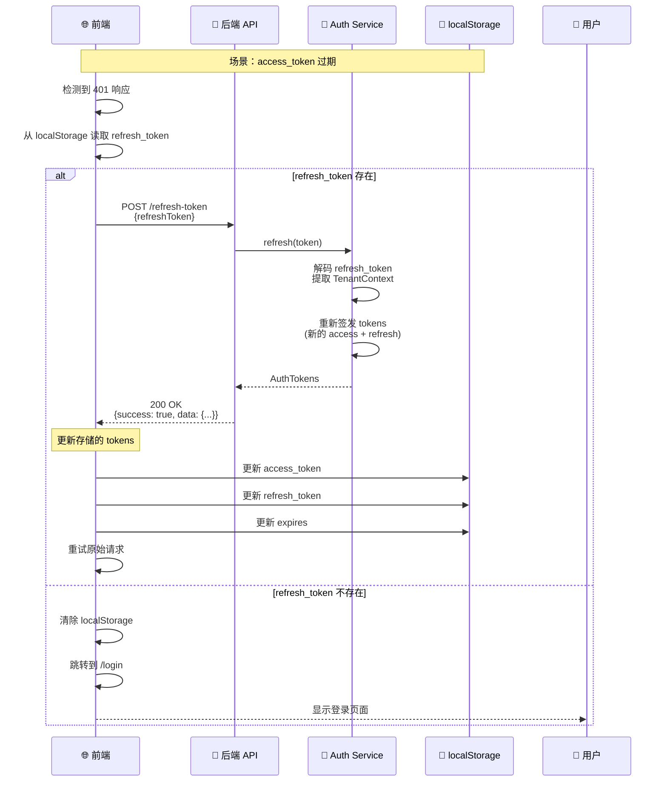

**安全设计：**
- `access_token` TTL 短（如 1 小时）
- `refresh_token` TTL 长（如 7 天）
- 每次刷新都生成新的 refresh_token（防止重放攻击）

---

## 动态路由加载流程

```mermaid
sequenceDiagram
    participant FE as 🌐 前端 (Vue Router)
    participant Store as 🗃️ Pinia Store
    participant API as 🚀 后端 API
    participant Auth as 🔐 认证中间件

    Note over FE: 用户已登录，首次访问或刷新页面

    FE->>FE: 检查 localStorage.async-routes
    alt 路由缓存存在且未过期
        Note over FE: 使用缓存的路由
        FE->>FE: 直接加载路由
    else 无缓存或缓存过期
        FE->>API: GET /get-async-routes<br/>Authorization: Bearer xxx
        API->>Auth: 验证 token
        Auth->>Auth: 提取 TenantContext.roles
        Auth->>Auth: 提取 TenantContext.permissions

        alt 用户是 admin
            Note over API: 返回完整 EMS 菜单
            API-->>FE: 200 OK<br/>{
  routes: [
    {path: "/ems", children: [
      {path: "/ems/projects", ...},
      {path: "/ems/gateways", ...},
      {path: "/ems/devices", ...},
      {path: "/ems/points", ...},
      {path: "/ems/point-mappings", ...}
    ]}
  ]
}
        else 用户有特定角色
            Note over API: 基于权限过滤路由
            API-->>FE: 200 OK<br/>{
  routes: [
    {path: "/ems", children: [
      {path: "/ems/projects", meta: {auths: ["PROJECT.READ"]}},
      ...
    ]}
  ]
}
        end

        FE->>FE: 解析异步路由
        FE->>FE: 查找 /src/views/** 对应组件
        Note over FE: import.meta.glob 动态导入
        FE->>FE: 注册到 Vue Router
        FE->>FE: 存储到 localStorage.async-routes
        FE->>FE: 生成侧边栏菜单
    end
```

**路由结构：**
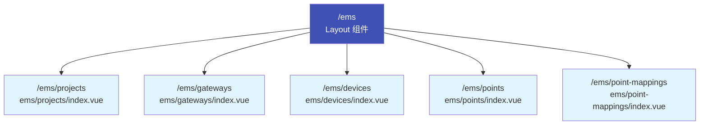

---

## 错误处理流程

```mermaid
graph TB
    subgraph "错误来源"
        AUTH[AuthError]
        STORAGE[StorageError]
        VALID[ValidationError]
    end

    subgraph "错误类型"
        E1[InvalidCredentials<br/>401]
        E2[TokenExpired/Invalid<br/>401]
        E3[NotFound<br/>404]
        E4[Conflict<br/>409]
        E5[Forbidden<br/>403]
        E6[Internal<br/>500]
    end

    subgraph "统一响应格式"
        APIR[ApiResponse<br/>{
  success: false,
  error: {code, message}
}]
    end

    AUTH --> E1
    AUTH --> E2
    STORAGE --> E3
    STORAGE --> E4
    STORAGE --> E5
    VALID --> E6

    E1 --> APIR
    E2 --> APIR
    E3 --> APIR
    E4 --> APIR
    E5 --> APIR
    E6 --> APIR

    APIR -->|响应头 x-request-id| FE[前端]
    FE -->|显示错误提示| USER[用户]

    style AUTH fill:#ff6b6b
    style STORAGE fill:#ffa726
    style VALID fill:#4db6ac
    style APIR fill:#ffd93d
```

---

## 数据库查询示例（以 Project 为例）

```mermaid
graph LR
    A[Handler 调用] --> B[TenantContext<br/>tenant_id = "tenant-1"]
    B --> C[ProjectStore.list_projects]
    C --> D[SQL 查询生成]
    D --> E["SELECT * FROM projects<br/>WHERE tenant_id = $1"]
    E --> F[PostgreSQL 执行]
    F --> G[返回 ProjectRecord[]]
    G --> H[Handler 接收]
    H --> I[转换为 ProjectDto]
    I --> J[ApiResponse 包装]
    J --> K[HTTP 响应]

    style B fill:#d1c4e9
    style E fill:#4caf50
    style I fill:#2196f3
```

**租户隔离保证：**
- 所有查询自动带 `WHERE tenant_id = ?`
- 跨租户数据访问在 SQL 层面被阻止
- `tenant_id` 从 JWT 提取，不在 API 参数中

---

## 完整用户操作流程示例

### 场景：用户登录后创建一个网关

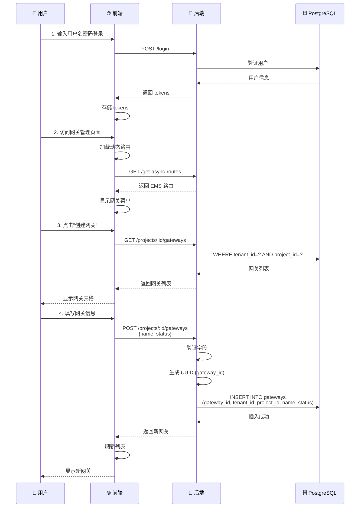

---

## 规划中的功能（M3-M5）

### M3: MQTT 数据采集闭环（规划中）

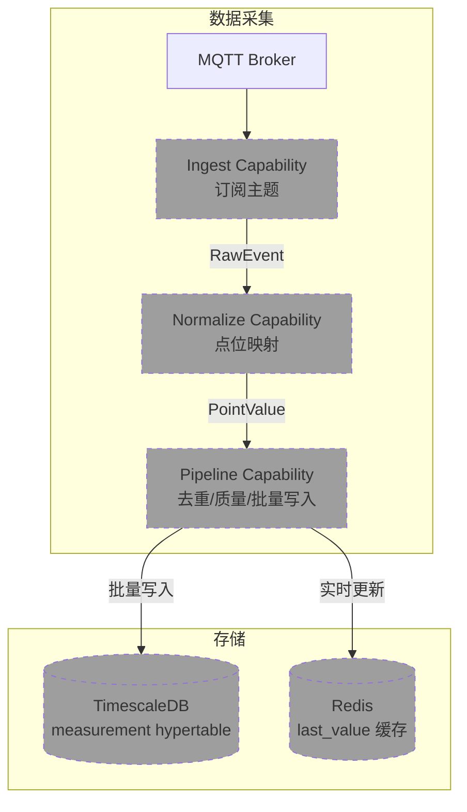

### M4: 控制下发闭环（规划中）

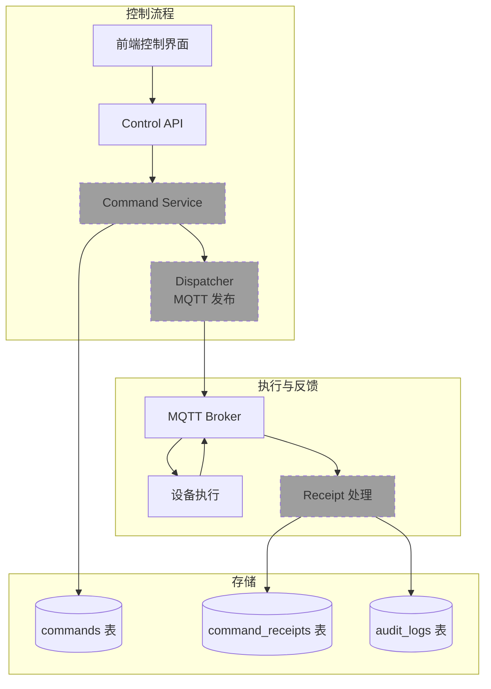

### M5: 告警框架（规划中）

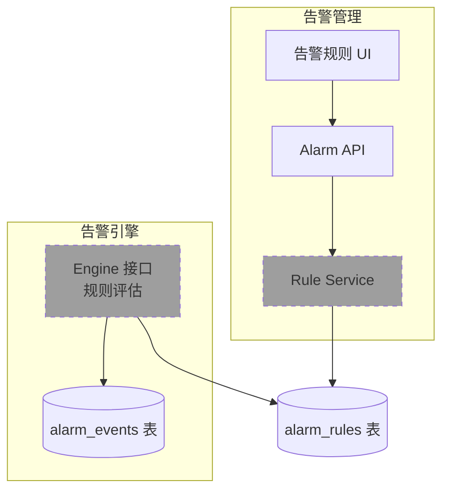

---

## 总结

**当前运行的核心流程：**

1. ✅ **认证流程**：用户登录 → JWT 签发 → Token 存储 → 后续请求携带
2. ✅ **API 请求**：request_context → JWT 验证 → TenantContext 提取 → 项目归属验证 → Storage 调用
3. ✅ **数据 CRUD**：前端验证 → Handler 验证 → Storage 执行 → PostgreSQL 查询 → DTO 转换 → 响应返回
4. ✅ **动态路由**：Token 验证 → 角色权限提取 → 路由生成 → 前端注册 → 菜单显示
5. ✅ **多租户隔离**：JWT 提取 tenant_id → SQL 过滤 tenant_id → 跨租户访问阻止

**关键设计原则：**
- 📐 **依赖方向**：domain → storage → handler → api
- 🔒 **租户隔离**：所有数据访问显式传递 TenantContext
- 🚪 **中间件链**：request_id/trace_id → JWT 验证 → 项目归属
- 📦 **统一响应**：ApiResponse 包装所有 API 输出
- 🗄️ **SQL 集中**：所有数据库操作在 storage 层，handler 无 SQL

**下一步扩展方向：**
- 📡 实现 MQTT 采集（M3）
- 🎮 实现控制下发（M4）
- 🚨 实现告警引擎（M5）
- 📊 集成 TimescaleDB 时序存储
- ⚡ 集成 Redis 实时缓存
