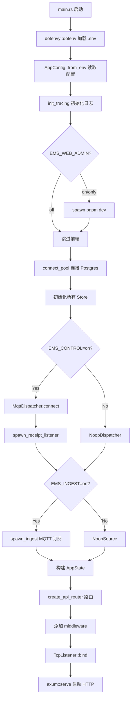
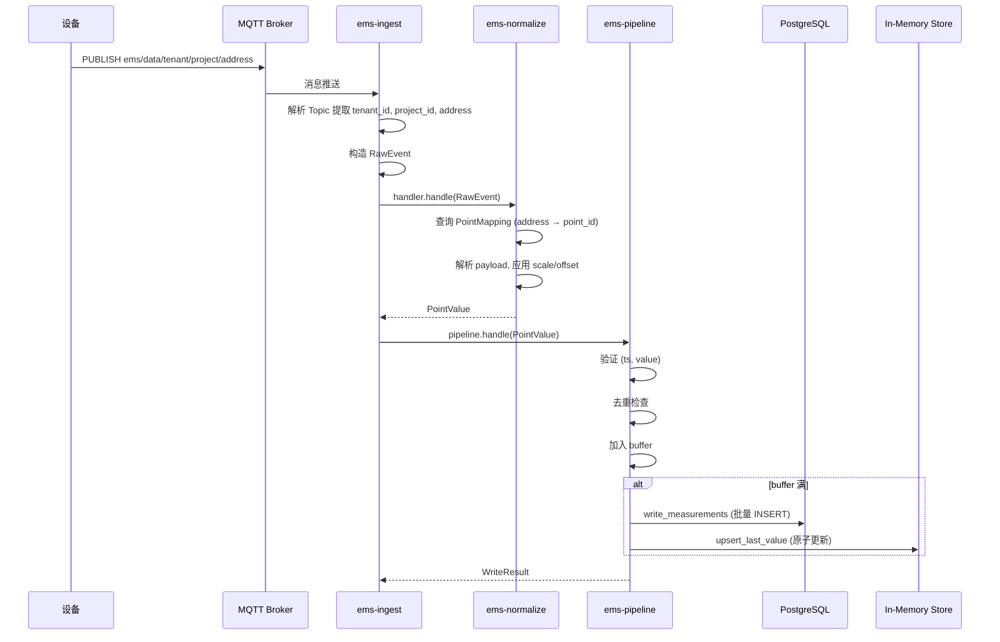
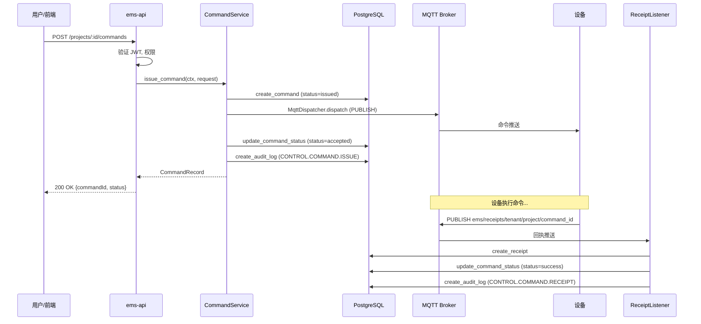
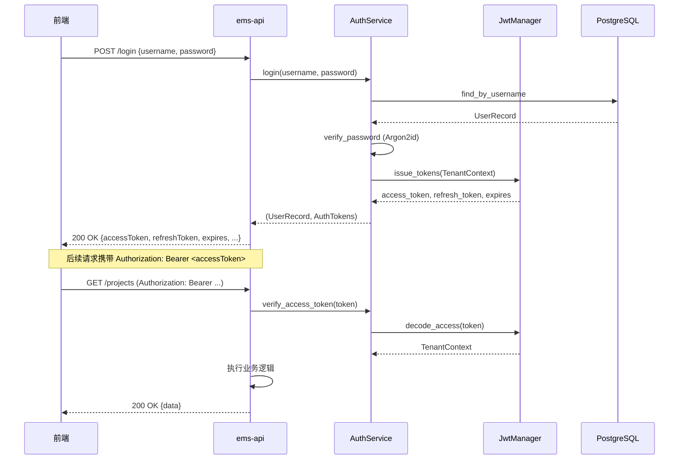

# EMS 工程参考（架构/流程/目录）

> 本文档存放工程实现细节、目录结构与流程图；运维与部署请看 `docs/project-management/OPERATION_MANUAL.md`。  
> 最后更新: 2026-01-24

## 目录

1. [工程书（代码功能详解）](#1-工程书代码功能详解)
2. [项目框架（目录树）](#2-项目框架目录树)
3. [项目运行流程图](#3-项目运行流程图)

---

## 1. 工程书（代码功能详解）

### 1.1 后端架构

#### 1.1.1 Workspace 结构

```
ems/
├── apps/
│   └── ems-api/              # HTTP API 二进制入口
│       └── src/
│           ├── main.rs       # 主函数，启动流程
│           ├── routes.rs     # 路由定义
│           ├── handlers/     # HTTP Handler 实现
│           ├── middleware/   # 认证中间件
│           ├── ingest.rs     # 采集链路装配
│           └── utils/        # 响应工具、验证
└── crates/
    ├── core/
    │   ├── domain/           # 领域模型
    │   └── api-contract/     # DTO 契约
    └── capability/
        ├── auth/             # 认证能力
        ├── config/           # 配置加载
        ├── control/          # 反向控制
        ├── ingest/           # 数据采集
        ├── normalize/        # 数据标准化
        ├── pipeline/         # 数据流水线
        ├── storage/          # 存储抽象
        └── telemetry/        # 遥测指标
```

#### 1.1.2 核心模块详解

##### `domain` (crates/core/domain)

**文件:** `lib.rs`, `data.rs`, `permissions.rs`

**功能:**
- 定义 `TenantContext`: 租户上下文，包含 `tenant_id`, `user_id`, `roles`, `permissions`, `project_scope`
- 定义 `RawEvent`: 原始采集事件
- 定义 `PointValue`, `PointValueData`: 标准化点位值
- 定义 `permissions` 常量: 所有权限码

```rust
pub struct TenantContext {
    pub tenant_id: String,
    pub user_id: String,
    pub roles: Vec<String>,
    pub permissions: Vec<String>,
    pub project_scope: Option<String>,
}
```

##### `api-contract` (crates/core/api-contract)

**文件:** `lib.rs`

**功能:**
- 定义所有 API 请求/响应 DTO
- 定义 `ApiResponse<T>` 标准响应封装
- 定义 `error_codes` 常量

**关键 DTO:**
- `LoginRequest/LoginResponse`: 登录
- `CreateProjectRequest/ProjectDto`: 项目 CRUD
- `CreateDeviceRequest/DeviceDto`: 设备 CRUD
- `CreateCommandRequest/CommandDto`: 控制命令
- `MeasurementsQuery/MeasurementValueDto`: 历史查询
- `RealtimeQuery/RealtimeValueDto`: 实时查询

##### `auth` (crates/capability/auth)

**文件:** `lib.rs`, `jwt.rs`, `password.rs`

**功能:**
- `AuthService`: 登录验证、Token 校验、Token 刷新
- `JwtManager`: JWT 编码/解码 (HS256)
- `hash_password`, `verify_password_and_maybe_upgrade`: Argon2id 密码哈希

**登录流程:**
1. 查询用户 (`UserStore::find_by_username`)
2. 验证密码 (`verify_password_and_maybe_upgrade`)
3. 签发 Token (`JwtManager::issue_tokens`)

##### `config` (crates/capability/config)

**文件:** `lib.rs`

**功能:**
- `AppConfig::from_env()`: 从环境变量加载全部配置
- 支持类型安全解析、默认值、必填校验

##### `ingest` (crates/capability/ingest)

**文件:** `lib.rs`

**功能:**
- `MqttSource`: MQTT 采集源实现
- `RawEventHandler` Trait: 原始事件处理接口
- Topic 解析: `{prefix}/{tenant_id}/{project_id}/{address}`

**核心逻辑:**
```rust
impl Source for MqttSource {
    async fn run(&self, handler: Arc<dyn RawEventHandler>) -> Result<(), IngestError> {
        // 1. 订阅 Topic
        // 2. 循环 poll 消息
        // 3. 解析 tenant_id/project_id/address
        // 4. 构造 RawEvent 调用 handler.handle()
    }
}
```

##### `normalize` (crates/capability/normalize)

**文件:** `lib.rs`

**功能:**
- `Normalizer`: 将 RawEvent 转换为 PointValue
- `PointMappingProvider` Trait: 点位映射查询接口
- `StoragePointMappingProvider`: 基于 Storage 的实现

**转换流程:**
1. 根据 `address` 查询 `PointMapping`
2. 解析 payload 为 `f64`
3. 应用 `scale` 和 `offset`
4. 返回 `PointValue`

##### `pipeline` (crates/capability/pipeline)

**文件:** `lib.rs`

**功能:**
- `Pipeline`: 数据处理流水线 (批量、去重、重试)
- `PointValueWriter` Trait: 写入接口
- `StoragePointValueWriter`: 写入 Measurement + LastValue (内存)

**特性:**
- 批量写入 (`batch_size`)
- 背压控制 (`max_buffer_size`)
- 重复值过滤 (`dedup_cache_size`)
- 过期值丢弃 (`max_age_ms`)

##### `control` (crates/capability/control)

**文件:** `lib.rs`

**功能:**
- `CommandService`: 命令下发服务
- `MqttDispatcher`: MQTT 命令下发实现
- `spawn_receipt_listener`: MQTT 回执监听

**命令状态流转:**
```
issued → accepted → success/failed/timeout
```

##### `storage` (crates/capability/storage)

**文件:** `lib.rs`, `traits.rs`, `models.rs`, `postgres/`, `in_memory/`

**功能:**
- 定义所有存储 Trait: `UserStore`, `ProjectStore`, `DeviceStore`, `PointStore`, `PointMappingStore`, `MeasurementStore`, `RealtimeStore`, `CommandStore`, `AuditLogStore` 等
- PostgreSQL 实现: `PgUserStore`, `PgProjectStore`, ...
- InMemory 实现: 用于测试和实时数据缓存

**设计原则:**
- 所有方法显式接收 `TenantContext`
- 多租户隔离: SQL 查询自动添加 `tenant_id` 过滤

##### `telemetry` (crates/capability/telemetry)

**文件:** `lib.rs`

**功能:**
- `init_tracing`: 初始化日志
- `TelemetryMetrics`: 采集指标 (原子计数器)
- 指标记录函数: `record_raw_event`, `record_write_success`, `record_command_issued`, ...

#### 1.1.3 API Handler 详解

位于 `apps/ems-api/src/handlers/`：

| 文件 | 端点 | 功能 |
|------|------|------|
| `auth.rs` | `/login`, `/refresh-token`, `/get-async-routes`, `/livez`, `/readyz`, `/health` | 认证、动态路由、探针 |
| `projects.rs` | `/projects` | 项目 CRUD |
| `gateways.rs` | `/projects/:id/gateways` | 网关 CRUD |
| `devices.rs` | `/projects/:id/devices` | 设备 CRUD |
| `points.rs` | `/projects/:id/points` | 点位 CRUD |
| `point_mappings.rs` | `/projects/:id/point-mappings` | 点位映射 CRUD |
| `realtime.rs` | `/projects/:id/realtime` | 实时查询 |
| `measurements.rs` | `/projects/:id/measurements` | 历史查询 (支持聚合) |
| `commands.rs` | `/projects/:id/commands` | 控制命令发送、查询 |
| `audit.rs` | `/projects/:id/audit` | 审计日志查询 |
| `rbac.rs` | `/rbac/users`, `/rbac/roles`, `/rbac/permissions` | RBAC 管理 |
| `metrics.rs` | `/metrics` | 遥测指标快照（需 Bearer token + `SYSTEM.METRICS.READ`） |

### 1.2 前端架构

#### 1.2.1 技术栈

- **框架:** Vue 3 + Composition API
- **构建:** Vite 7
- **UI 库:** Element Plus
- **状态管理:** Pinia
- **路由:** Vue Router 4 (Hash 模式)
- **样式:** TailwindCSS 4 + SCSS
- **模板:** Pure Admin Thin v6.2.0

#### 1.2.2 目录结构

```
web/admin/src/
├── api/            # API 请求封装
├── assets/         # 静态资源
├── components/     # 公共组件
├── config/         # 应用配置
├── directives/     # 自定义指令
├── layout/         # 布局组件 (侧边栏、导航栏、标签页)
├── plugins/        # 插件注册
├── router/         # 路由配置
├── store/          # Pinia 状态管理
├── style/          # 全局样式
├── utils/          # 工具函数
├── views/          # 页面视图
│   ├── ems/        # EMS 业务页面
│   │   ├── projects/
│   │   ├── gateways/
│   │   ├── devices/
│   │   ├── points/
│   │   ├── point-mappings/
│   │   ├── realtime/
│   │   ├── measurements/
│   │   ├── commands/
│   │   ├── audit/
│   │   └── rbac/
│   ├── login/
│   └── error/
├── App.vue
└── main.ts
```

#### 1.2.3 动态路由

前端路由由后端 `/get-async-routes` 接口动态返回，根据用户权限过滤。

### 1.3 数据库 Schema

#### 1.3.1 核心表

```sql
-- 租户
tenants (tenant_id PK, name, status, created_at)

-- 项目
projects (project_id PK, tenant_id FK, name, timezone, created_at)

-- 用户
users (user_id PK, tenant_id FK, username UNIQUE, password_hash, status, created_at)

-- 角色与权限 (全局)
roles (role_code PK, name)
permissions (permission_code PK, description)
user_roles (user_id, role_code) PK
role_permissions (role_code, permission_code) PK

-- 角色与权限 (租户级)
tenant_roles (tenant_id, role_code, name) PK(tenant_id, role_code)
tenant_user_roles (tenant_id, user_id, role_code) PK
tenant_role_permissions (tenant_id, role_code, permission_code) PK
```

#### 1.3.2 资产表

```sql
gateways (gateway_id PK, tenant_id, project_id, name, status, last_seen_at)
devices (device_id PK, tenant_id, project_id, gateway_id, name, model)
points (point_id PK, tenant_id, project_id, device_id, key, data_type, unit)
point_sources (source_id PK, tenant_id, project_id, point_id, source_type, address, scale, offset_value)
```

#### 1.3.3 时序表 (TimescaleDB Hypertable)

```sql
measurement (tenant_id, project_id, point_id, ts, value, quality)
-- 索引: (tenant_id, project_id, point_id, ts DESC)

event (tenant_id, project_id, ts, type, payload JSONB)
```

#### 1.3.4 控制与审计表

```sql
commands (command_id PK, tenant_id, project_id, target, payload JSONB, status, issued_by, issued_at)
command_receipts (receipt_id PK, tenant_id, project_id, command_id, ts, status, message)
audit_logs (audit_id PK, tenant_id, project_id, actor, action, resource, result, detail, ts)
```

---

## 2. 项目框架（目录树）

```
ems/
├── apps/
│   └── ems-api/                   # HTTP API 主程序
│       ├── Cargo.toml
│       └── src/
│           ├── main.rs            # 入口：配置、初始化、路由、启动
│           ├── routes.rs          # 路由映射
│           ├── ingest.rs          # 采集链路装配
│           ├── handlers/          # 业务 Handler
│           │   ├── mod.rs
│           │   ├── auth.rs
│           │   ├── projects.rs
│           │   ├── gateways.rs
│           │   ├── devices.rs
│           │   ├── points.rs
│           │   ├── point_mappings.rs
│           │   ├── realtime.rs
│           │   ├── measurements.rs
│           │   ├── commands.rs
│           │   ├── audit.rs
│           │   ├── rbac.rs
│           │   └── metrics.rs
│           ├── middleware/        # 中间件
│           │   ├── mod.rs
│           │   └── auth.rs
│           └── utils/             # 工具
│               ├── mod.rs
│               ├── response.rs
│               └── validation.rs
├── crates/
│   ├── core/
│   │   ├── domain/                # 领域模型
│   │   │   ├── Cargo.toml
│   │   │   └── src/
│   │   │       ├── lib.rs         # TenantContext
│   │   │       ├── data.rs        # RawEvent, PointValue, PointValueData
│   │   │       └── permissions.rs # 权限码常量
│   │   └── api-contract/          # API 契约
│   │       ├── Cargo.toml
│   │       └── src/
│   │           └── lib.rs         # 所有 DTO 定义
│   └── capability/
│       ├── auth/                  # 认证能力
│       │   └── src/
│       │       ├── lib.rs         # AuthService
│       │       ├── jwt.rs         # JwtManager
│       │       └── password.rs    # Argon2id
│       ├── config/                # 配置加载
│       │   └── src/lib.rs         # AppConfig
│       ├── control/               # 反向控制
│       │   └── src/lib.rs         # CommandService, MqttDispatcher
│       ├── ingest/                # 数据采集
│       │   └── src/lib.rs         # MqttSource
│       ├── normalize/             # 数据标准化
│       │   └── src/lib.rs         # Normalizer
│       ├── pipeline/              # 数据流水线
│       │   └── src/lib.rs         # Pipeline
│       ├── storage/               # 存储抽象
│       │   └── src/
│       │       ├── lib.rs         # 模块导出
│       │       ├── traits.rs      # 存储 Trait 定义
│       │       ├── models.rs      # 数据模型
│       │       ├── error.rs       # StorageError
│       │       ├── connection.rs  # PgPool
│       │       ├── validation.rs  # 租户验证
│       │       ├── online.rs      # OnlineStore Trait
│       │       ├── postgres/      # Pg 实现
│       │       └── in_memory/     # 内存实现
│       └── telemetry/             # 遥测
│           └── src/lib.rs         # Metrics
├── web/
│   └── admin/                     # Vue3 前端
│       ├── package.json
│       ├── vite.config.ts
│       └── src/
│           ├── views/ems/         # EMS 业务页面
│           ├── api/               # API 封装
│           ├── router/            # 路由
│           ├── store/             # Pinia
│           └── layout/            # 布局
├── migrations/                    # 数据库迁移
│   ├── 001_init.sql
│   ├── 002_seed.sql
│   ├── 003_assets.sql
│   ├── 004_timescale.sql
│   ├── 005_control.sql
│   └── 006_rbac.sql
├── scripts/                       # 运维脚本
│   ├── db-init.sh                 # 数据库初始化
│   ├── health-check.sh            # 健康检查
│   ├── mvp-acceptance.sh          # 验收测试
│   ├── rbac-acceptance.sh         # RBAC 验收
│   ├── mqtt-simulate.sh           # MQTT 数据模拟
│   ├── control-receipt-simulate.sh # 回执模拟
│   ├── device-emulator.sh         # 设备模拟器
│   └── stability-check.sh         # 稳定性测试
├── Cargo.toml                     # Workspace 配置
├── .env                           # 环境变量
└── *.md                           # 文档
```

---

## 3. 项目运行流程图

### 3.1 系统启动流程



### 3.2 数据采集流程



### 3.3 控制命令流程



### 3.4 认证流程



